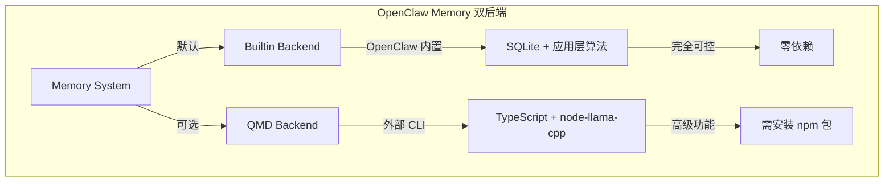
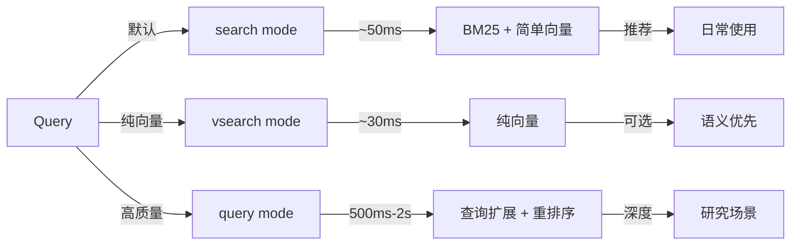
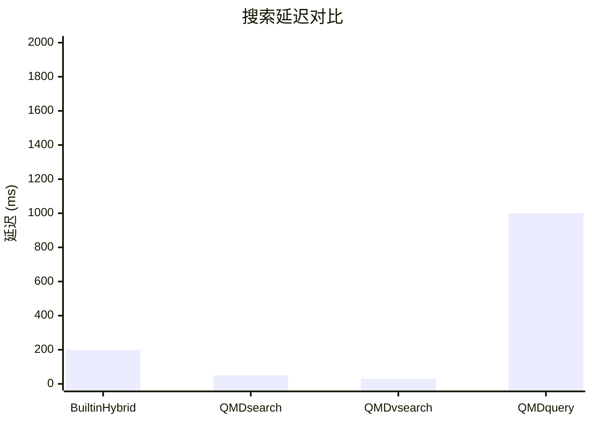
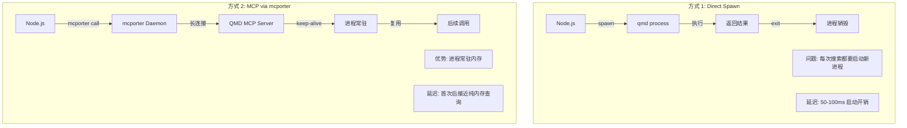
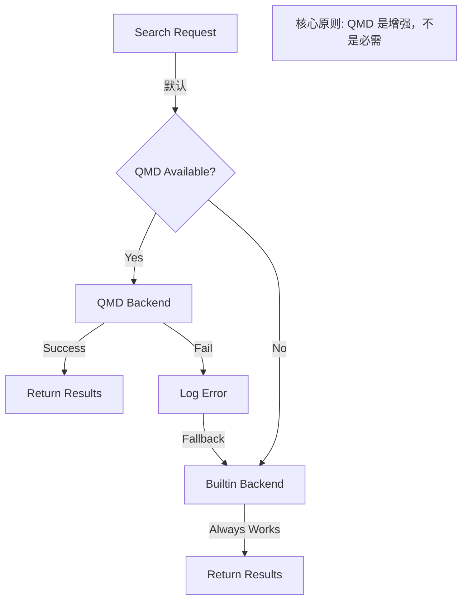
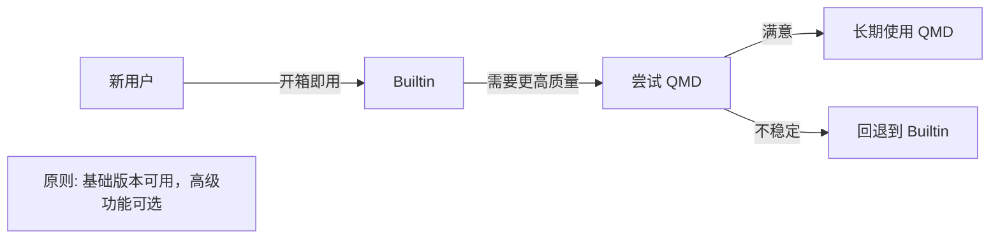

#openclaw #memory #qmd #backend #typescript #node-llama-cpp #mcp #performance

> 深入分析 QMD (Quick Markdown Database) 后端的设计原理、优势及与 Builtin 后端的对比

---

## QMD 是什么？

**QMD** = Quick Markdown Database，是 [tobi/qmd](https://github.com/tobi/qmd) 开发的 **TypeScript** 命令行工具，专门用于 Markdown 文档的高性能检索。

**关键信息**：
- **主要语言**: TypeScript (79.1%) + Python (18.6%)
- **运行环境**: Node.js 22+ / Bun
- **包名**: `@tobilu/qmd`
- **本地模型**: 使用 node-llama-cpp 加载 GGUF 模型

### 定位



---

## 为什么需要 QMD？Builtin 的局限性

### Builtin 的三大痛点

| 痛点 | 具体问题 | 影响 |
|------|---------|------|
| **算法能力受限** | 依赖外部 API 或简单算法 | 无法使用本地 cross-encoder、query expansion 等高级算法 |
| **性能瓶颈** | Hybrid Search + MMR 都是应用层计算 | CPU 上很慢，特别是 `query` mode |
| **查询理解弱** | 简单的停用词过滤，无法语义扩展 | 用户问 "thing we discussed" 找不到相关文档 |

### 具体场景对比

**场景 1: 复杂查询**
```
用户: "that thing we discussed yesterday about the API"

Builtin:
- 去掉停用词 -> "discussed API"
- 可能漏掉 "authentication" "OAuth" 等相关概念

QMD query mode:
- Query Expansion: "API authentication OAuth design"
- 召回率显著提升
```

**场景 2: 重排序质量**
```
Builtin MMR:
- 基于向量相似度的贪心选择
- 计算快但质量一般

QMD Re-rank:
- Cross-encoder 精排模型
- 理解更深，结果质量更高
```

---

## QMD 的核心优势

### 1. 三种搜索模式



| 模式 | 命令 | 特点 | 延迟 | 适用场景 |
|------|------|------|------|----------|
| **search** | `qmd search` | BM25 + 简单向量 | ~50ms | **默认推荐**，日常使用 |
| **vsearch** | `qmd vsearch` | 纯向量搜索 | ~30ms | 语义匹配优先 |
| **query** | `qmd query` | 查询扩展 + 重排序 | 500ms-2s | 最高质量，深度研究 |

**代码体现** (`src/config/types.memory.ts`):
```typescript
export type MemoryQmdSearchMode = "query" | "search" | "vsearch";

// backend-config.ts 注释:
// Defaulting to `query` can be extremely slow on CPU-only systems
// (query expansion + rerank).
// Prefer a faster mode for interactive use.
const DEFAULT_QMD_SEARCH_MODE = "search";
```

### 2. 查询扩展 (Query Expansion)

**问题**: 用户查询和文档内容的不匹配
```
用户: "how to implement authentication"
文档: "API auth configuration guide"

问题: "authentication" ≠ "auth"，BM25 无法匹配
```

**QMD 解决方案**:
```
原始查询: "authentication implementation"
扩展后: "authentication auth OAuth login security API"
```

**实现**: QMD 内置了高效的查询扩展算法，使用本地 LLM 模型生成查询变体。

### 3. 重排序 (Re-ranking)

**Builtin MMR vs QMD Cross-encoder**:

| 特性 | Builtin MMR | QMD Re-rank |
|------|-------------|-------------|
| **算法** | 基于向量相似度的贪心选择 | Cross-encoder 精排模型 |
| **理解深度** | 浅层（向量相似度） | 深层（BERT 语义理解） |
| **计算成本** | O(n²) 向量计算 | 更高，但本地模型优化 |
| **结果质量** | 一般 | 显著更好 |

### 4. 性能优势

**延迟对比 (P95)**:



**为什么更快？**
- **专用进程**: QMD 作为独立进程运行，资源隔离
- **本地模型**: 使用 node-llama-cpp 加载本地 GGUF 模型，无需网络调用
- **预建索引**: 在后台维护优化过的索引结构
- **专用算法**: 针对搜索场景专门优化的查询扩展和重排序

---

## MCP 协议集成

### 什么是 MCP？

**MCP** = Model Context Protocol，一种标准化的 LLM 工具调用协议。

### 两种调用方式对比



### mcporter 集成代码

**配置** (`src/config/types.memory.ts`):
```typescript
export type MemoryQmdMcporterConfig = {
  enabled?: boolean;        // 是否启用 MCP
  serverName?: string;      // 默认 "qmd"
  startDaemon?: boolean;    // 自动启动守护进程
};
```

**实现** (`src/memory/qmd-manager.ts`):
```typescript
private async runQmdSearchViaMcporter(params: {
  tool: "search" | "vector_search" | "deep_search";
  query: string;
  limit: number;
}) {
  // 确保 mcporter 守护进程已启动
  await this.ensureMcporterDaemonStarted(params.mcporter);
  
  const selector = `${params.mcporter.serverName}.${params.tool}`;
  
  const result = await this.runMcporter([
    "call", selector,
    "--args", JSON.stringify({ query, limit }),
    "--output", "json"
  ]);
  
  return JSON.parse(result.stdout);
}
```

---

## 故障降级机制

### 设计哲学：优雅降级



### 实现代码

**Search Manager 层** (`src/memory/search-manager.ts`):
```typescript
async search(query: string) {
  if (this.backend === "qmd") {
    try {
      return await this.qmdManager.search(query);
    } catch (err) {
      // QMD 失败，记录并降级
      log.warn("qmd failed; switching to builtin");
      
      // 从缓存中移除失败的 QMD 管理器
      QMD_MANAGER_CACHE.delete(this.cacheKey);
      
      // 切换到 Builtin
      this.fallbackToBuiltin();
    }
  }
  
  // 使用 Builtin 兜底
  return this.builtinManager.search(query);
}
```

**关键决策**:
- ✅ QMD 失败不影响功能
- ✅ 自动切换到 Builtin
- ✅ 下次请求可重试 QMD
- ✅ 用户无感知

---

## 架构决策：为什么共存而非替换？

### 渐进式采用策略



### 对比总结

| 维度 | Builtin | QMD | 建议 |
|------|---------|-----|------|
| **实现语言** | TypeScript (OpenClaw 内置) | TypeScript (独立进程) | - |
| **依赖** | SQLite only | 需安装 qmd CLI | Builtin 零依赖 |
| **搜索模式** | Hybrid (固定) | search/vsearch/query | QMD 更灵活 |
| **查询扩展** | ❌ | ✅ | QMD 胜 |
| **重排序** | MMR | Cross-encoder | QMD 胜 |
| **性能** | ~200ms | ~50ms (search) | QMD 胜 |
| **适用场景** | 默认/通用 | 追求质量/可安装工具 | 根据场景选择 |

---

## 给 dm_claw 的启示

### Python 生态的优势

相比 OpenClaw (TypeScript)，dm_claw (Python) 有更好的选择：

```python
# Python 有丰富的 IR 库
from sentence_transformers import CrossEncoder  # 重排序
import faiss  # 高性能向量搜索
from rank_bm25 import BM25Okapi  # BM25

# 可以直接在 Python 层实现 QMD 的大部分功能
# 无需依赖外部 TypeScript 服务
```

### 建议架构

```python
class MemoryBackend(ABC):
    @abstractmethod
    async def search(self, query: str) -> List[Result]:
        pass

class BuiltinBackend(MemoryBackend):
    """基础版本：SQLite + sentence-transformers"""
    pass

class EnhancedBackend(MemoryBackend):
    """增强版本：+ Cross-encoder + Query Expansion"""
    pass
```

---

## 总结

### QMD 解决了什么问题？

1. **算法能力**: 本地查询扩展、Cross-encoder 重排序（无需网络调用）
2. **性能**: 本地模型推理，避免 API 延迟
3. **灵活性**: 三种搜索模式适应不同场景

### 核心设计思想

- **渐进增强**: Builtin 默认可用，QMD 是可选增强
- **故障降级**: QMD 失败自动回退，保证可用性
- **协议标准化**: MCP 协议支持，长连接降低延迟

### 关键洞察

> QMD 不是替代 Builtin，而是**可选的高级功能**。这种双后端设计让 OpenClaw 既保持了开箱即用的简单性，又提供了追求高质量的可能。

---

*相关文档: [[openclaw_memory_源码|Memory 源码分析]], [[openclaw_memory_设计思想|Memory 设计思想]], [[openclaw_overview|项目概览]]*
