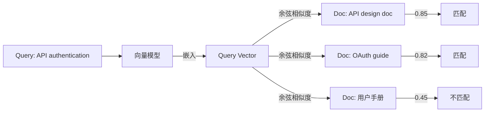
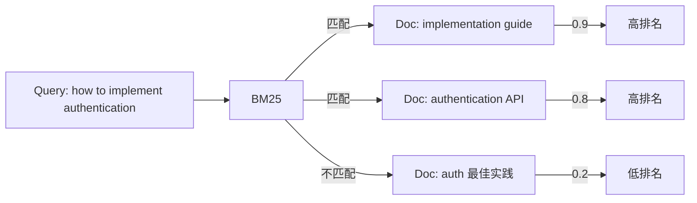
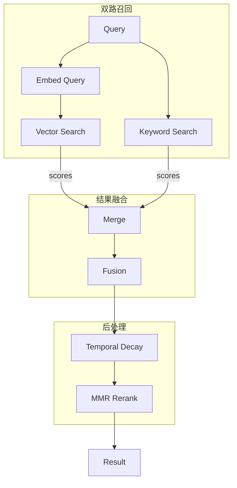
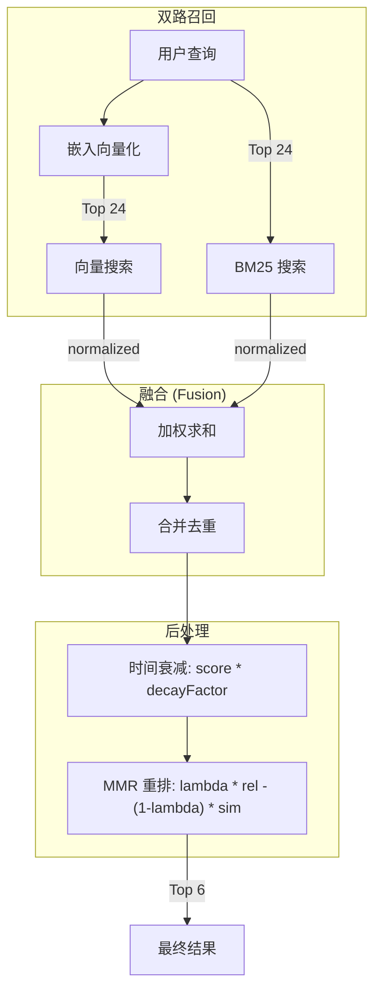

# OpenClaw 混合搜索技术详解

#openclaw #memory #hybrid-search #bm25 #mmr #algorithm

> 深入分析 Hybrid Search (向量 + BM25) 的实现原理和优化策略

## 问题背景

### 纯向量搜索的局限



**问题**:
- 无法精确匹配关键词（如 "OAuth" vs "authentication"）
- 可能遗漏包含精确术语但语义略有差异的文档

### 纯 BM25 的局限



**问题**:
- "authentication" 和 "auth" 被视为不同词
- 无法理解语义相似性

## 解决方案：混合搜索

### 架构设计



### 核心实现

**文件**: `src/memory/hybrid.ts`

```typescript
export function mergeHybridResults(
  vectorResults: VectorResult[],
  keywordResults: KeywordResult[],
  vectorWeight: number = 0.7,    // 可配置
  textWeight: number = 0.3       // 可配置
): HybridResult[] {
  const merged = new Map<string, HybridResult>();
  
  // 1. 归一化向量分数到 0-1
  const maxVectorScore = Math.max(...vectorResults.map(r => r.score));
  
  for (const result of vectorResults) {
    merged.set(result.id, {
      ...result,
      vectorScore: result.score / maxVectorScore,
      textScore: 0,
      finalScore: (result.score / maxVectorScore) * vectorWeight
    });
  }
  
  // 2. 归一化 BM25 分数
  for (const result of keywordResults) {
    // BM25 rank 越低越好，转换为 0-1 分数
    // rank 0 = 1.0, rank 10 = 0.09
    const textScore = 1 / (1 + Math.max(0, result.rank));
    
    if (merged.has(result.id)) {
      // 已在向量结果中，累加分数
      const existing = merged.get(result.id)!;
      existing.textScore = textScore;
      existing.finalScore += textScore * textWeight;
    } else {
      // 仅关键词匹配
      merged.set(result.id, {
        ...result,
        vectorScore: 0,
        textScore,
        finalScore: textScore * textWeight
      });
    }
  }
  
  // 3. 按最终分数排序
  return Array.from(merged.values())
    .sort((a, b) => b.finalScore - a.finalScore);
}
```

**融合公式**:
```
finalScore = vectorWeight * normalizedVectorScore + 
             textWeight * normalizedBM25Score

默认: 0.7 * vector + 0.3 * text
```

### 候选池扩展策略

```typescript
// manager-search.ts
async search(query: string, options: SearchOptions) {
  const candidateMultiplier = 4;  // 可配置
  
  // 召回 4 倍结果
  const vectorResults = await this.searchVector(
    queryVector, 
    options.maxResults * candidateMultiplier  // 6 * 4 = 24
  );
  
  const keywordResults = await this.searchKeyword(query);
  // 也给同样数量的候选
}
```

**为什么需要 4x 扩展？**
- 给融合算法更多选择空间
- 让 MMR 多样性重排有足够候选
- 平衡性能和召回率

## MMR 多样性重排

### 问题：结果同质化

```
Query: "router configuration"

Top results:
1. "Configured Omada router..." (score: 0.95)
2. "Configured Omada router..." (score: 0.93)  ← 重复！
3. "Configured Omada router..." (score: 0.91)  ← 重复！
```

### MMR 算法

**文件**: `src/memory/mmr.ts`

```typescript
export function applyMMR(
  results: SearchResult[],
  queryVector: number[],
  lambda: number = 0.7,      // 相关性权重
  maxResults: number
): SearchResult[] {
  const selected: SearchResult[] = [];
  const candidates = [...results];
  
  while (selected.length < maxResults && candidates.length > 0) {
    let bestMMR = -Infinity;
    let bestIndex = -1;
    
    for (let i = 0; i < candidates.length; i++) {
      const candidate = candidates[i];
      
      // 1. 计算与查询的相关性
      const relevance = cosineSimilarity(queryVector, candidate.embedding);
      
      // 2. 计算与已选结果的最大相似度
      let maxSimToSelected = 0;
      for (const sel of selected) {
        const sim = jaccardSimilarity(candidate.text, sel.text);
        maxSimToSelected = Math.max(maxSimToSelected, sim);
      }
      
      // 3. MMR 分数 = λ * 相关性 - (1-λ) * 相似度
      const mmrScore = lambda * relevance - (1 - lambda) * maxSimToSelected;
      
      if (mmrScore > bestMMR) {
        bestMMR = mmrScore;
        bestIndex = i;
      }
    }
    
    selected.push(candidates.splice(bestIndex, 1)[0]);
  }
  
  return selected;
}
```

**算法原理**:
```
MMR = λ * relevance(query, doc) - (1-λ) * max(similarity(doc, selected))

λ = 0.7 (默认):
- 更重视相关性
- 轻微惩罚重复内容

λ = 0.5:
- 平衡相关性和多样性

λ = 0.3:
- 更重视多样性
- 适合 exploratory search
```

**文本相似度计算**:
```typescript
function jaccardSimilarity(text1: string, text2: string): number {
  const set1 = new Set(tokenize(text1));
  const set2 = new Set(tokenize(text2));
  
  const intersection = new Set([...set1].filter(x => set2.has(x)));
  const union = new Set([...set1, ...set2]);
  
  return intersection.size / union.size;
}
```

使用 Jaccard 而非向量相似度，更直观反映文本重复程度。

### MMR 效果示例

```
Query: "router configuration"

Before MMR:
1. "Configured Omada router..." (0.95)
2. "Configured Omada router..." (0.93)
3. "Configured Omada router..." (0.91)
4. "Set up AdGuard DNS..." (0.85)
5. "Router VLAN config..." (0.82)

After MMR (λ=0.7):
1. "Configured Omada router..." (0.95)        ← 选
2. "Set up AdGuard DNS..." (0.85 × 1.0 = 0.85) ← diverse, 选
3. "Router VLAN config..." (0.82 × 1.0 = 0.82) ← diverse, 选
4. "Configured Omada router..." (0.93 - 0.9 = 0.03) ← 相似度高，弃
5. "Configured Omada router..." (0.91 - 0.9 = 0.01) ← 相似度高，弃
```

## 时间衰减

### 问题：旧文档排名过高

```
Query: "Rod standup time"

Without decay:
1. memory/2025-09-15.md - "Rod works Mon-Fri..." (score: 0.91)
2. memory/2026-02-10.md - "Rod has standup at 14:15..." (score: 0.82)

问题: 2025-09 的文档已经过时，但语义匹配度更高！
```

### 指数衰减公式

**文件**: `src/memory/temporal-decay.ts`

```typescript
export function applyTemporalDecay(
  results: SearchResult[],
  halfLifeDays: number = 30
): void {
  const now = Date.now();
  const lambda = Math.log(2) / halfLifeDays;  // 衰减系数
  
  for (const result of results) {
    // 从文件名提取日期
    const fileDate = extractDateFromPath(result.path);
    if (!fileDate) continue;  // 非日期文件不衰减
    
    const ageInDays = (now - fileDate.getTime()) / (1000 * 60 * 60 * 24);
    const decayFactor = Math.exp(-lambda * ageInDays);
    
    result.score *= decayFactor;
    result.temporalDecayApplied = true;
  }
}
```

**衰减曲线** (半衰期 30 天):
```
Day 0:  score × 1.00 = 100%
Day 7:  score × 0.86 = 86%
Day 30: score × 0.50 = 50%
Day 90: score × 0.125 = 12.5%
```

**特殊处理**: `MEMORY.md` 和 `memory/projects.md` 等**非日期文件不衰减**，视为常青文档。

### 效果对比

```
Query: "Rod standup time"

With decay (halfLife=30):
1. memory/2026-02-10.md - 0.82 × 1.00 = 0.82  ← 今天，最新
2. memory/2026-02-03.md - 0.80 × 0.85 = 0.68  ← 7天前
3. memory/2025-09-15.md - 0.91 × 0.03 = 0.03  ← 5个月前，几乎忽略
```

## 完整搜索流程



## 性能优化

### 1. 并行查询

```typescript
// 向量搜索和关键词搜索并行执行
const [vectorResults, keywordResults] = await Promise.all([
  this.searchVector(queryVector, topK * 4),
  this.searchKeyword(query)
]);
```

### 2. 数据库索引

```sql
-- 向量查询优化
CREATE INDEX idx_chunks_path ON chunks(path);
CREATE INDEX idx_chunks_source ON chunks(source);

-- FTS5 自动优化
-- 无需额外索引
```

### 3. 早停策略

```typescript
// MMR 提前终止条件
if (selected.length >= maxResults) break;
if (bestMMR < threshold) break;  // 分数过低不再选择
```

## 参数调优建议

| 参数 | 默认值 | 调整建议 |
|------|--------|----------|
| `vectorWeight` | 0.7 | 语义搜索为主保持 0.7，关键词为主降到 0.5 |
| `textWeight` | 0.3 | 与 vectorWeight 互补，和为 1 |
| `candidateMultiplier` | 4 | 追求速度降到 2，追求质量升到 8 |
| `mmr.lambda` | 0.7 | 多样性要求高降到 0.5 |
| `temporalDecay.halfLifeDays` | 30 | 快速变化主题降到 7，稳定知识升到 90 |

## 设计思想总结

1. **互补性**: 向量 + 关键词互补各自的盲区
2. **候选池**: 先广泛召回，再精排截断
3. **多样性**: MMR 避免结果同质化
4. **时效性**: 时间衰减让新内容优先
5. **可配置**: 所有参数可调，适应不同场景

---

*相关文档: [[openclaw_memory_源码|Memory 源码分析]], [[openclaw_memory_设计思想|Memory 设计思想]]*
