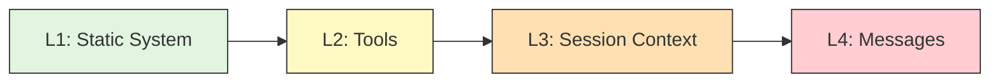
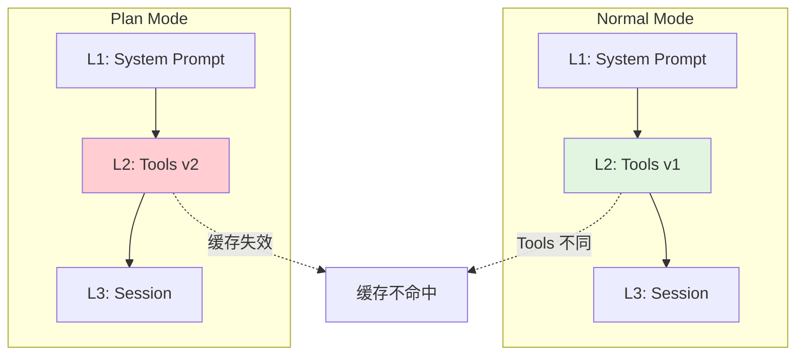
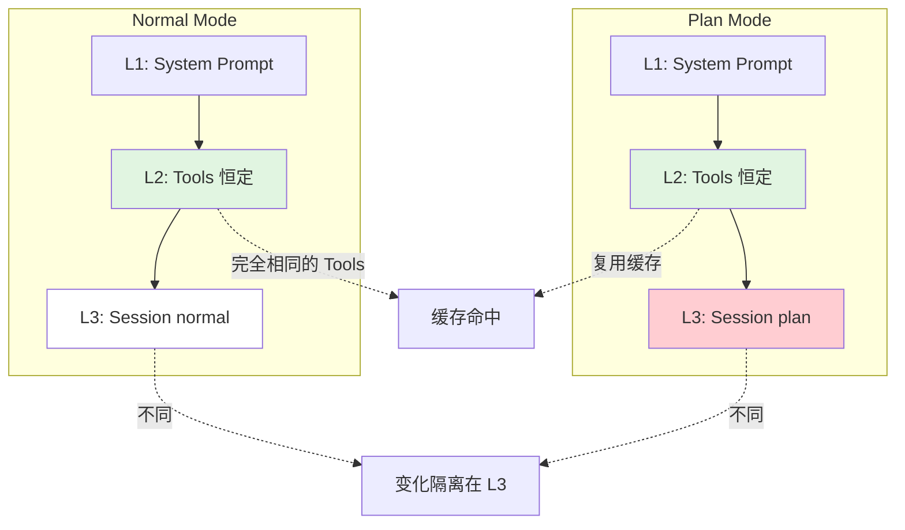
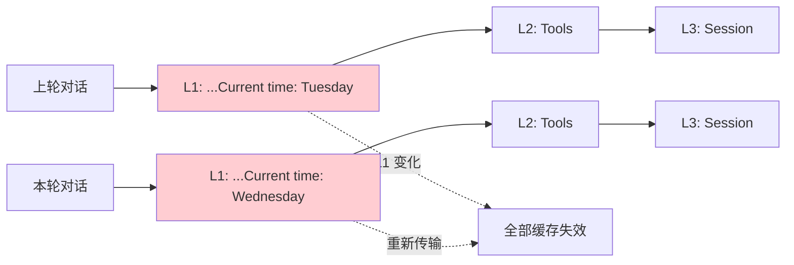
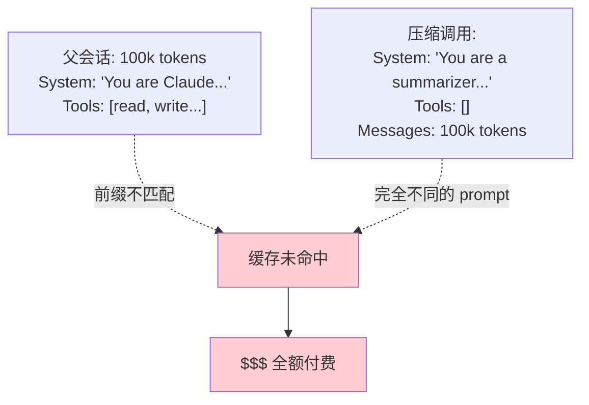
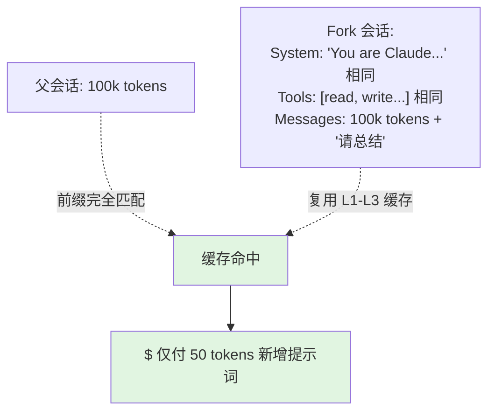
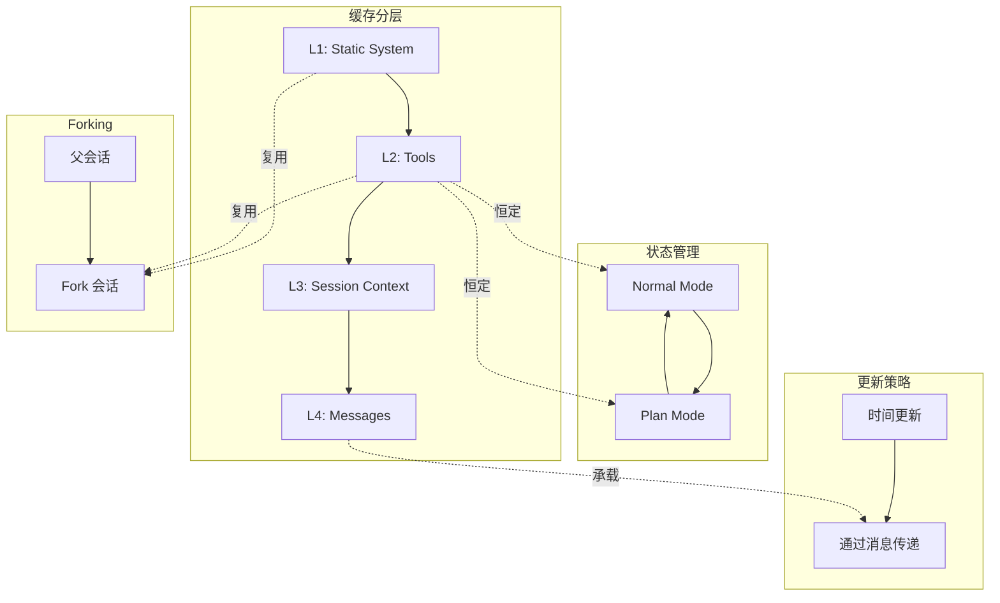

# Prompt Caching 深度解析 - Claude Code 工程实践

**来源**: Lessons from Building Claude Code: Prompt Caching Is Everything
**原文地址**: https://x.com/trq212/status/2024574133011673516?s=20
**日期**: 2026-03-10

---

## 核心原理：前缀匹配 + 分层缓存

Prompt Caching 不是整体缓存，而是**分层前缀缓存**。每个 `cache_control` 断点将 prompt 分成不同缓存层。

### 四层缓存架构



**关键规则**：
- 每层有独立的缓存 key（hash）
- 只要**该层及之前所有层**不变，就能命中缓存
- **任何一层的变化**只会影响该层及之后的缓存，不会向前传播

---

## 关键技巧 1：状态工具化（State-as-Tool）

### 场景：实现 Plan Mode（只读不写）

**直觉做法的问题**：动态移除 write 工具 → Tools 层变化 → 缓存失效

**正确做法**：Tools 层恒定，状态信息放在更后的层

### 对比图解

#### ❌ 错误做法：修改 Tools 层



**结果**：每次切换 Mode，Tools 层重新传输，成本高昂。

#### ✅ 正确做法：Tools 层恒定



**关键洞察**：
1. **Tools 层永远不变** → L2 层 100% 缓存命中
2. **状态信息（current_mode）放在 L3 Session 层** → 只影响 L3 之后的缓存
3. **通过 system message 告知模型** "你现在在 Plan Mode"，而不是通过移除工具

### 分层放置策略

| 信息类型 | 放置位置 | 缓存范围 | 变化频率 |
|---------|---------|---------|---------|
| 你是谁（Claude Code） | L1: System Prompt | 全局 | 极低 |
| 能做什么（read/write/EnterPlanMode） | L2: Tools | 所有会话 | 极低 |
| 当前状态（Plan Mode） | L3: Session Context | 单个会话 | 中 |
| 具体任务（用户输入） | L4: Messages | 单轮 | 高 |

**为什么这样更高效**：
- 1000 个会话 → 共享相同的 L1 + L2 → 只需传一次
- 每个会话 → 有自己的 L3 → 但该会话内 100 轮对话共享
- 每轮对话 → 只有 L4 是全新的

---

## 关键技巧 2：用消息传递更新

### 场景：时间从 Tuesday 变为 Wednesday

**直觉做法**：更新 System Prompt 里的时间 → L1 变化 → 所有缓存失效

**正确做法**：在下一条消息里传递更新时间

### 对比图解

#### ❌ 错误做法：修改 L1



#### ✅ 正确做法：消息传递

```
System Prompt (L1): "你是 Claude，时间通过消息提供"
                     ↓ 从不改变，100% 缓存
Tools (L2): [read, write, ...]
                     ↓ 从不改变，100% 缓存
Session (L3): {working_dir: "/path"}
                     ↓ 会话级缓存
Messages (L4):
  User: "帮我查代码"
  → 当前时间: Tuesday（上轮消息）
  Assistant: "..."
  User: "<system-reminder>现在 Wednesday</system-reminder> 再查一下"
  → 只有这条是新的
```

**效果**：L1-L3 完全不变，只有 L4 新增一条消息，成本极低。

---

## 关键技巧 3：缓存安全 Forking

### 场景：上下文压缩（Compaction）

当会话超过 100k tokens 时，需要总结历史并开新会话。

#### ❌ 错误做法：独立调用



#### ✅ 正确做法：Fork 复用前缀



**关键操作**：
- 保持 System Prompt 完全相同
- 保持 Tools 定义完全相同
- 仅追加一条 user message: "请总结上述对话"
- API 视角：这与父会话的请求几乎一样 → 缓存前缀匹配

---

## 整体架构总览



---

## 设计原则总结

### 1. 静态前移，动态后置
```
✅ 正确顺序: System → Tools → Config → Context → Messages
❌ 错误顺序: System(含时间) → Tools → ...
            时间变化会导致 System 层缓存失效
```

### 2. 恒定优于完美
```
❌ 直觉: "Plan Mode 不需要 write 工具，移除它"
✅ 现实: "保留 write 工具，通过 prompt 告诉模型不要用"
        Tools 层恒定 → 缓存持续有效
```

### 3. 消息优于修改
```
❌ 修改 System Prompt 传递更新 → L1 缓存失效
✅ 在下条消息里传递更新 → 只有 L4 变化
```

---

## 监控指标

| 指标 | 目标 | 报警阈值 |
|-----|------|---------|
| L1+L2 缓存命中率 | >99% | <95% 触发 SEV |
| L3 缓存命中率 | >90% | 按会话监控 |
| 单请求成本突增 | <2x 均值 | 检测异常模式 |

**关键洞察**：缓存命中率每下降 1%，成本可能上升 10-20%。
