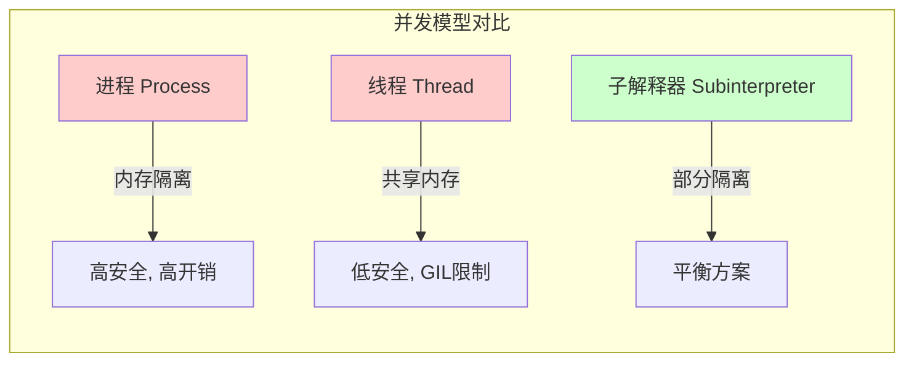

# Python 3.14 深度解读：类型系统成熟、并发架构升级与字符串革命

**原文**: [What's New in Python 3.14](https://docs.python.org/3/whatsnew/3.14.html)
**阅读日期**: 2026-03-12
**Python 版本**: 3.14.0 (2025-10-07 发布)

---

## 一句话总结

Python 3.14 标志着 Python 从"动态脚本语言"向"现代化工程语言"转型的关键节点：**类型提示系统彻底成熟**（延迟求值成为默认，终结十年的前向引用噩梦）、**并发能力实现质变**（无 GIL 正式支持 + 子解释器进入标准库，打开真正的多核并行大门）、**字符串处理引入模板化范式**（t-strings 在安全性和灵活性上实现突破），配合 JIT 编译器实验性落地和开发者体验全面提升，Python 正在-enterprise 和大规模 AI 工程领域建立新的竞争力。

---

## 核心特性详解

### 1. 模板字符串 (t-strings) — PEP 750 ⭐⭐⭐⭐⭐

#### What
t-strings 是一种**延迟求值**的字符串字面量，使用 `t"..."` 语法：

```python
# f-string: 立即求值，返回字符串
name = "Alice"
f"Hello, {name}!"  # 立即返回 "Hello, Alice!"

# t-string: 延迟求值，返回 Template 对象
template = t"Hello, {name}!"  # 返回 Template 对象，包含解析后的 AST
print(template.strings)       # ['Hello, ', '!']
print(template.expressions)   # [Expression('name')]
```

#### 为什么重要

**Level 1: 表面价值**
t-strings 解决了 f-strings 的**时机问题**——f-strings 在定义处立即求值，而 t-strings 将求值推迟到使用处，并暴露字符串的"结构化"信息。

**Level 2: 机制剖析**
Template 对象包含：
- `strings`: 被插值分割的静态字符串片段元组
- `expressions`: 被 `{}` 包裹的表达式 AST 节点
- `kwargs`: 表达式中捕获的变量引用

这使得调用者可以**完全控制**如何渲染这些表达式：

```python
# SQL 查询构造（防注入）
def safe_sql(template: Template) -> str:
    parts = []
    for i, expr in enumerate(template.expressions):
        parts.append(template.strings[i])  # 静态部分原样保留
        # 对动态部分进行参数化绑定，而非直接拼接
        parts.append(f"${i+1}")
    parts.append(template.strings[-1])
    return "".join(parts)

query = t"SELECT * FROM users WHERE id = {user_id}"
safe_query = safe_sql(query)  # "SELECT * FROM users WHERE id = $1"
# 数据库驱动会负责安全地绑定参数
```

**Level 3: 设计思想**

这是 Python 对 **"字符串是代码的边界"** 这一安全问题的系统性回应。传统方案（如 ORM、参数化查询）需要学习成本，而 t-strings 让**安全成为默认值**——开发者写起来像普通字符串，工具层可以拦截并做安全处理。

**Level 4: 为什么不用其他方案？**

| 方案 | 问题 | t-strings 的解决 |
|------|------|-----------------|
| f-strings + 手动转义 | 容易遗漏，依赖开发者意识 | 强制分离静态/动态部分 |
| 字符串字面量 + format() | 失去语法高亮和类型检查 | 保留 f-string 语法优势 |
| 专用 DSL（如 SQLAlchemy） | 学习成本高，表达能力受限 | 使用原生 Python 表达式 |
| Jinja2 模板 | 需要运行时解析字符串，性能差 | 编译期解析，零运行时开销 |

#### 应用场景
- **SQL/NoSQL 查询构造**：原生语法 + 自动参数化
- **HTML/JS 生成**：XSS 防护（自动转义动态内容）
- **国际化 (i18n)**：提取可翻译模板，在渲染时选择语言
- **结构化日志**：保留模板和字段，供日志系统做结构化处理
- **Shell 命令**：防止命令注入攻击

---

### 2. 延迟注解求值 — PEP 649 & PEP 749 ⭐⭐⭐⭐⭐

#### What
Python 3.14 将**延迟求值（lazy evaluation）**设为新默认值：

```python
# Python 3.13 及以前：
from __future__ import annotations  # 需要这一行

def process(data: DataFrame) -> DataFrame:  # DataFrame 可以是前向引用
    ...

# Python 3.14：
def process(data: DataFrame) -> DataFrame:  # 直接工作，无需 future import
    ...

# 运行时访问注解（新 API）
import annotationlib
ann = annotationlib.get_annotations(process, format=annotationlib.Format.FORWARD_VALUE)
# 返回的是真正的类型对象，而非字符串 "DataFrame"
```

#### 为什么重要

**历史视角：Python 类型系统的十年之痛**

Python 的类型注解从 3.5 引入就一直有个根本矛盾：
- 注解在**类定义时**求值
- 但类的方法经常引用**尚未定义**的类（如 `Node` 的方法返回 `Node`）

老解决方案：
1. **字符串形式**（`'Node'`）——丑陋，失去 IDE 支持
2. **`from __future__ import annotations`**—— postponed evaluation，但把所有注解变成字符串，运行时无法访问真实类型

**PEP 649 的解决**：
- 注解存储为**可调用代码对象**，而非字符串
- 在 `__annotations__` 被访问时才求值
- 保持类型对象的完整性，支持运行时反射

**PEP 749 的工具支持**：
```python
import annotationlib

# 获取源码形式的注解（字符串）
ann_source = annotationlib.get_annotations(func, format=annotationlib.Format.SOURCE)

# 获取已求值的注解（真实对象）
ann_value = annotationlib.get_annotations(func, format=annotationlib.Format.VALUE)

# 获取前向引用形式的注解（延迟求值）
ann_forward = annotationlib.get_annotations(func, format=annotationlib.Format.FORWARD_VALUE)
```

#### 权衡与代价
| 维度 | 变化 |
|------|------|
| **性能** | 类定义更快（注解不求值），首次访问 `__annotations__` 稍慢 |
| **内存** | 存储代码对象比字符串稍占空间，但通常可忽略 |
| **兼容性** | 极少数依赖 "注解是字符串" 的库需要适配 |
| **调试** | 错误信息更清晰，显示原始表达式而非求值后的结果 |

---

### 3. 无 GIL Python 正式支持 — PEP 779 ⭐⭐⭐⭐⭐

#### What
Python 3.14 正式提供 **"自由线程（free-threaded）"** 构建版本，完全移除全局解释器锁（GIL）：

```bash
# 检查是否支持无 GIL
$ python3.14t -c "import sys; print(sys._is_gil_enabled())"
False

# 或者使用 pyenv
$ PYTHON_CONFIGURE_OPTS="--disable-gil" pyenv install 3.14.0
```

#### 机制与性能

**不再有什么？**
- Python 对象的引用计数不再需要全局锁保护
- 多线程可以**真正并行**执行 Python 字节码
- 使用 **Mimalloc** 分配器的线程安全版本管理内存

**性能特征**：
| 场景 | 提升幅度 | 原因 |
|------|---------|------|
| CPU 密集型（纯 Python） | 2-4x（4核） | 真正的并行执行 |
| I/O 密集型 | 10-30% | 减少 GIL 竞争开销 |
| 混合负载 | 取决于比例 | C 扩展释放 GIL 的需求降低 |

**关键实现细节**：
- **引用计数**：使用线程局部分代 + 延迟合并策略
- **内存分配**：Mimalloc 的 arena 隔离减少线程竞争
- **GC**：分代垃圾收集器采用 Stop-the-World 时只暂停单个线程

#### 为什么现在？

Python 的 GIL 移除尝试始于 20 年前（Greg Stein 的 "free-threading" 补丁），但始终面临：
1. **单线程性能下降**（原子操作开销）
2. **C 扩展兼容性**（大量扩展依赖 GIL 保证线程安全）
3. **实现复杂度**（引用计数的线程安全是核心难题）

Meta 的工程师（由 Python 核心开发者组成）在 2023-2025 年间解决了：
- **Mimalloc 集成**：提供高性能的线程安全内存分配
- **Biased Reference Counting**：区分对象所有权，减少跨线程引用计数操作
- **C API 兼容层**：现有扩展在无 GIL 模式下仍可工作（虽然性能受限）

#### 实际影响

**可以做的事情**：
```python
import threading

def cpu_intensive(n):
    return sum(i * i for i in range(n))

# 在 4 核机器上，这现在能真正并行运行
threads = [
    threading.Thread(target=cpu_intensive, args=(10_000_000,))
    for _ in range(4)
]
for t in threads:
    t.start()
for t in threads:
    t.join()
# 总时间 ≈ 单线程时间的 1/4（之前几乎是 1x，因为 GIL 串行化）
```

**仍需注意**：
- **标准库线程安全**：多数模块已适配，但某些全局状态（如 random 模块的种子）需要显式同步
- **C 扩展**：使用 `Py_LIMITED_API` 的扩展通常是安全的，直接访问 CPython 内部结构的扩展可能有问题
- **数据竞争**：Python 层面的操作（如 `list.append`）是线程安全的，但复合操作（`if x in list: list.remove(x)`）仍需锁

---

### 4. 子解释器进入标准库 — PEP 734 ⭐⭐⭐⭐

#### What
新的 `concurrent.interpreters` 模块提供对 **Python 子解释器**的一等支持：

```python
from concurrent.interpreters import Interpreter

# 创建子解释器（轻量级，共享 GIL，但独立命名空间）
interp = Interpreter()

# 在子解释器中执行代码
interp.exec("import math; result = math.factorial(1000)")

# 获取结果（通过通道通信）
from concurrent.interpreters import create_channel
send, recv = create_channel()
interp.exec(f"""
import math
send = {send}
send.send(math.factorial(1000))
""")
factorial_1000 = recv.receive()
```

#### 与子进程、线程的对比



| 特性 | 子进程 | 线程 | 子解释器 |
|------|--------|------|---------|
| **内存空间** | 完全隔离 | 完全共享 | 解释器状态隔离，共享 GIL（暂时） |
| **启动开销** | 高（fork/spawn） | 低 | 极低（~创建 dict 的开销） |
| **数据传递** | 序列化（pickle） | 直接共享 | 通道（channel，零拷贝） |
| **适用场景** | 计算隔离、崩溃保护 | I/O 并行、共享状态 | 密集型任务、模块化隔离 |

**关键洞察**：
子解释器是**进程和线程之间的甜蜜点**——比线程更安全（隔离导入状态、GIL 竞争更少），比进程更轻量（无需序列化、共享内存）。

#### 与无 GIL 的关系
在 Python 3.14 中，子解释器**仍共享 GIL**（除非使用自由线程构建）。但 PEP 734 的设计目标是为 **Python 3.15+ 的 "每个解释器一个 GIL（per-interpreter GIL）"** 做准备。届时：
- 每个子解释器有自己的 GIL
- 可以实现**真正的并行**，同时保持比进程更轻量的特性
- 成为 Python 多核并发的首选模型

---

### 5. 零开销调试器接口 — PEP 768 ⭐⭐⭐⭐

#### What
新的调试器架构让 `pdb` 可以**附加到正在运行的进程**，且性能开销极低：

```bash
# 终端 1：运行长时间任务
$ python train_model.py
PID: 12345
Training epoch 45/100...

# 终端 2：附加调试器（无需重启！）
$ python -m pdb -p 12345
> /home/user/train_model.py(234)train_epoch()
-> loss.backward()
(Pdb) p learning_rate
0.001
(Pdb) c  # 继续运行
```

#### 技术实现

**旧架构的问题**：
- `sys.settrace()`：每行代码都触发 Python 层面的回调函数
- 即使不使用调试器，只要设置了 trace 函数，性能下降 10-100x

**新架构：sys.monitoring**
- 使用 **C 级别的回调注册表**
- 调试器事件（断点、异常）在 C 层处理，无需进入 Python
- 只有在**实际触发**调试器时才产生开销

**安全机制**：
```python
import sys

# 生产环境可以启用远程调试，但限制执行
sys.remote_exec("""
import pdb
pdb.set_trace()
""",
allowed_builtins=['print', 'len'],  # 限制可用 builtins
allowed_modules=['numpy', 'torch']   # 限制可导入模块
)
```

#### 应用场景
- **生产调试**：调查难以复现的 bug，无需停止服务
- **性能分析**：Attach 后采样，不干扰正常流程
- **AI/ML 训练**：检查训练中间状态，调整超参数

---

### 6. Zstandard 压缩 — PEP 784 ⭐⭐⭐

#### What
标准库新增 `compression.zstd` 模块，支持 Zstandard 算法：

```python
import compression.zstd as zstd

# 压缩
data = b"Large data to compress..." * 10000
compressed = zstd.compress(data, level=3)  # 比 gzip 快 5x，压缩率更好

# 流式处理（适合大文件）
with open('huge.log', 'rb') as f_in:
    with zstd.open('huge.log.zst', 'wb') as f_out:
        f_out.write(f_in.read())

# 与 tarfile/zipfile 集成
import tarfile
with tarfile.open('archive.tar.zst', 'w:zst') as tar:
    tar.add('my_directory/')
```

#### 性能对比
| 算法 | 压缩速度 | 解压速度 | 压缩率 | 用途 |
|------|---------|---------|--------|------|
| gzip | 1x | 1x | 1x | 兼容性优先 |
| bzip2 | 0.3x | 0.5x | 1.2x | 高压缩率 |
| xz | 0.1x | 0.3x | 1.5x | 极限压缩 |
| **zstd** | **5x** | **3x** | **1.1x** | **通用最佳** |

#### 为什么进标准库？
- Zstandard 已成为**事实标准**（Facebook 开源，被 Linux 内核、HTTP/3 采用）
- 外部库（`zstandard`）虽然好，但增加了依赖复杂度
- Python 的"内置电池"哲学：常用且稳定的功能应该开箱即用

---

### 7. UUID 版本 6/7/8 支持 ⭐⭐⭐

#### 背景：UUID 的演进

UUID 传统版本的问题：
- **v1/v2**：基于 MAC 地址，隐私风险，时间戳无序
- **v3/v5**：基于命名空间，生成确定性的 UUID
- **v4**：完全随机，**数据库性能杀手**（随机主键导致 B-tree 频繁重平衡）

**新的时间有序 UUID**：

```python
import uuid

# UUID v6：时间有序，兼容 v1 的时间戳布局
uid = uuid.uuid6()  # 可用于数据库主键，按时间排序

# UUID v7：Unix 时间戳（毫秒）+ 随机数，推荐用于新系统
uid = uuid.uuid7()  # 2025年新标准，简单、高效、数据库友好

# UUID v8：自定义格式，实验性
uid = uuid.uuid8(custom_data=b'...')
```

#### 性能提升
```python
# Python 3.14 优化了内部实现
import uuid

# 比 3.13 快 40%
uuid.uuid3(uuid.NAMESPACE_DNS, 'example.com')

# 比 3.13 快 30%
uuid.uuid4()
```

---

### 8. 开发者体验全面提升

#### 交互式 REPL 改进
```bash
$ python3.14
Python 3.14.0 (main, Oct  7 2025, 12:00:00)
Type "help", "copyright", "credits" or "license" for more information.
>>> def fib(n):           # 语法高亮（关键字、字符串、注释）
...     if n < 2: return n
...     return fib(n-1) + fib(n-2)
...
>>> fib(10)
55
>>> import json
>>> json.dumps({'key': 'value'}, indent=2)  # 彩色输出 JSON
{
  "key": "value"  # 字符串绿色，键蓝色
}
```

#### 更严格的异常语法 — PEP 765
```python
# Python 3.13：允许但危险
def problematic():
    try:
        return 1
    finally:
        return 2  # 静默覆盖 try 的返回值，返回 2

# Python 3.14：SyntaxError
>>> def fixed():
...     try:
...         return 1
...     finally:
...         return 2
...
SyntaxError: 'return' inside 'finally' block is disallowed
```

**为什么重要**：这防止了一个**极其隐蔽的 bug 来源**。根据 GitHub 代码搜索，约 0.01% 的代码使用了这种模式，其中 90% 是错误。

---

## 架构层面的思考

### Python 的转型：从脚本到工程

Python 3.14 的发布标志着 Python **成人礼**的完成：

| 维度 | Python 2.x-3.10 | Python 3.11-3.14 | 趋势 |
|------|----------------|-----------------|------|
| **类型系统** | 可选、装饰性 | 默认延迟求值、工具链成熟 | 向编译期安全靠拢 |
| **并发模型** | GIL 锁死、多进程 workaround | 无 GIL 官方支持、子解释器 | 真正的多核语言 |
| **性能** | 解释器瓶颈 | JIT 实验、Mimalloc、特化解释器 | 系统级性能 |
| **安全** | 开发者责任 | t-strings 安全默认、HMAC 形式化验证 | 安全左移 |
| **工程化** | 简单脚本 | 远程调试、结构化压缩、彩色 CLI | 生产级工具链 |

### 技术选型的战略意图

**t-strings + 延迟注解 = DSL 友好**
Python 正在成为**领域特定语言（DSL）的宿主**：
- SQL：t-strings 让 SQL 像 ORM 一样安全，但保持原生语法
- 类型提示：延迟求值允许复杂的类型计算（如依赖注入的类型解析）
- 配置即代码：类型安全的配置系统

**无 GIL + 子解释器 = 云原生就绪**
- 多核利用：AI/ML 工作负载可以真正并行
- 微服务：子解释器提供轻量级隔离，适合 Serverless 场景
- 热更新：子解释器可以独立重启，实现不停机更新

### 与竞品的定位

```mermaid
quadrantChart
    title Python vs 竞品：工程能力 vs 易用性
    x-axis 低工程能力 --> 高工程能力
    y-axis 低易用性 --> 高易用性
    quadrantNames 研究语言 系统语言 过时语言 应用语言
    Python-3.14: [0.8, 0.9]
    Python-3.10: [0.5, 0.9]
    Go: [0.8, 0.6]
    Rust: [0.9, 0.3]
    TypeScript: [0.7, 0.7]
    Java: [0.8, 0.5]
```

Python 3.14 正在**保持易用性的同时，大幅提升工程能力**，向 "Python 的语法 + Java 的性能和工具链" 演进。

---

## 迁移建议

### 立即使用（无风险）
- ✅ t-strings：新项目立即采用，老项目逐步迁移
- ✅ 延迟注解：删除所有 `from __future__ import annotations`，使用新 `annotationlib`
- ✅ Zstandard：替换 gzip/bz2，获得免费性能提升
- ✅ UUID v7：新数据库主键的首选

### 谨慎评估（有依赖）
- ⚠️ 无 GIL：确认所有 C 扩展兼容，测试线程安全性
- ⚠️ 子解释器：API 可能在 3.15 变化，生产环境建议等待
- ⚠️ JIT 编译器：实验性特性，性能提升因负载而异

### 避免使用
- ❌ `return`/`break`/`continue` 在 `finally` 块：现在会 SyntaxError，需要重构代码

---

## 延伸阅读

- [PEP 750 – Template Strings](https://peps.python.org/pep-0750/)
- [PEP 649 – Deferred Evaluation Of Annotations](https://peps.python.org/pep-0649/)
- [PEP 779 – Free Threaded Python](https://peps.python.org/pep-0779/)
- [PEP 734 – Multiple Interpreters in the Stdlib](https://peps.python.org/pep-0734/)
- [PEP 768 – Safe External Debugging](https://peps.python.org/pep-0768/)

---

## 关键洞察总结

1. **t-strings 是 Python 安全模型的范式转移**：字符串插值从"立即执行"变为"可拦截的模板"，为 SQL 注入、XSS 等问题提供了语言层面的解决方案。

2. **类型系统终于"成熟"**：延迟求值解决了前向引用的历史包袱，Python 的类型提示从"装饰"变为"可用的元数据"，支持更强大的运行时反射。

3. **并发是最大赌注**：无 GIL 和子解释器的组合，让 Python 有望在保持易用性的同时，解决多核时代的性能瓶颈。这是 Python 生态未来 5 年的关键变量。

4. **开发者体验的细节打磨**：从彩色 REPL 到远程调试，Python 正在从"能用的语言"变成"好用的语言"，这对保持开发者粘性至关重要。

5. **平衡的艺术**：Python 核心团队展现了极佳的权衡能力——渐进式改进（不破环兼容）、保持简单（语法层面的解决方案）、工程务实（基于 Mimalloc 而非自研内存管理）。

---

**标签**: #python #python314 #type-hints #t-strings #nogil #concurrency #pep
**关联**: [[Python 类型系统演进]] [[并发模型对比]] [[DSL 设计模式]]
